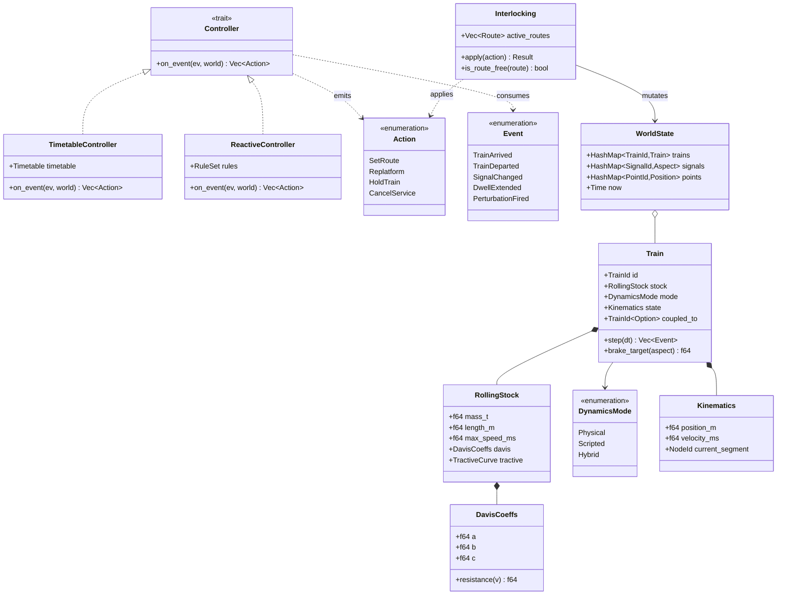
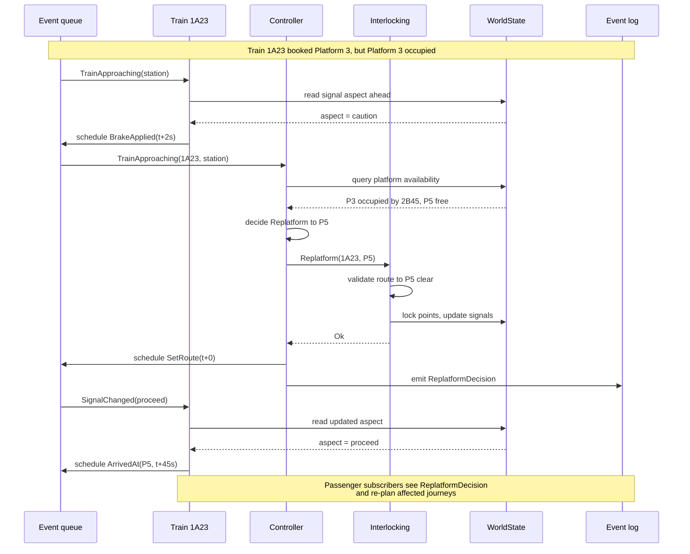
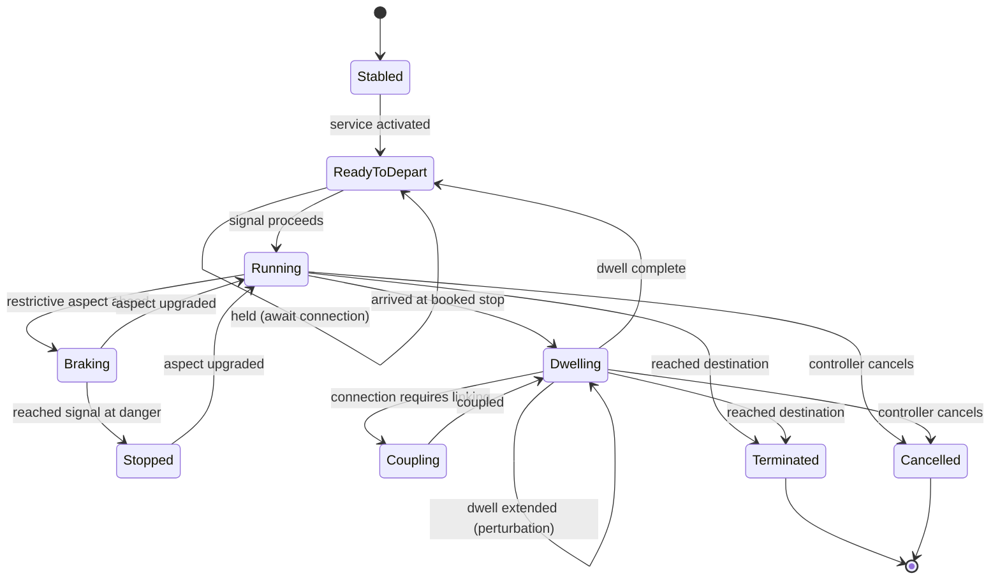

# UK Rail Simulator — System Architecture

A discrete-event simulator of the UK rail network, written in Rust, fed exclusively by RailML, with Python tooling for upstream data conversion.

## Goals and constraints

- **Language:** Rust for the simulator core. Python permitted only for data preparation.
- **Input format:** RailML 3.x is the sole ingest format for anything RailML can express. Python tools convert from Network Rail CIF, OpenRailwayMap, ORR rolling stock data, and realtime feeds into RailML before the Rust core sees them.
- **Physics:** Davis equation (`F_resist = A + B·v + C·v²`) with tractive-effort curves. Trains carry mass, length, air drag coefficients, maximum tractive effort at rest, and a TE/speed curve.
- **Infrastructure:** Signals, platforms, stations, points, and track segments simulated and positioned on a geographic representation of the network.
- **Hybrid timing:** Trains can run in physics mode (Davis integration) or scripted mode (follow recorded HSP/TRUST observations). Both modes coexist in the same simulation.
- **Performance focus:** Delays arising from perturbations to train movements, dwells, signaller decisions, and connection management.
- **Signaller behaviour:** Rerouting, replatforming, and ARS-like route-setting policies are first-class concerns.
- **Connections:** Trains can couple, divide, or hold for feeder services.
- **Future:** Passenger journey modelling to redefine performance metrics in terms of passenger-experienced delay rather than train-experienced delay.
- **Engine:** Discrete-event simulation with a time-ordered priority queue.

## Pipeline overview

The hard boundary at RailML means the Python side can evolve freely — new data sources, schema changes, ML-based geocoding — without ever forcing a Rust recompile. It also forces discipline: anything RailML can express must go through RailML, even when a JSON sidecar would be easier in the short term.

```
┌────────────────┐  ┌────────────────┐  ┌────────────────┐  ┌────────────────┐
│ Network Rail   │  │ OpenRailwayMap │  │   ORR / RDG    │  │ Realtime feeds │
│ CIF timetable  │  │ Track topology │  │ Rolling stock  │  │ (HSP, TRUST)   │
└───────┬────────┘  └───────┬────────┘  └───────┬────────┘  └───────┬────────┘
        │                   │                   │                   │
        └───────────────────┴───────────────────┴───────────────────┘
                                    │
                                    ▼
                  ┌─────────────────────────────────┐
                  │     Python ETL toolkit          │
                  │  parsing, geocoding,            │
                  │  gauge inference, validation    │
                  └────────────────┬────────────────┘
                                   │
                                   ▼
                  ┌─────────────────────────────────┐
                  │       RailML 3.x documents      │
                  │  infrastructure + rollingstock  │
                  │           + timetable           │
                  └────────────────┬────────────────┘
                                   │
                                   ▼
                  ┌─────────────────────────────────┐
                  │      Rust simulator core        │
                  │   (RailML is the only ingest)   │
                  └────────────────┬────────────────┘
                                   │
                       ┌───────────┴───────────┐
                       ▼                       ▼
              ┌─────────────────┐   ┌─────────────────┐
              │ Event log       │   │ KPIs and delay  │
              │ (Parquet)       │   │ metrics         │
              └─────────────────┘   └─────────────────┘
```

## Rust workspace layout

Split into a Cargo workspace of focused crates rather than one monolith. Dependencies flow strictly downward — `sim-types` and `sim-events` have no dependencies on anything in the workspace, and nothing depends on `sim-runner` except the binary itself.

| Layer | Crate | Responsibility |
|-------|-------|----------------|
| 5 | `sim-runner` | CLI, configuration, output writers, scenario orchestration |
| 4 | `sim-engine` | Event queue, scheduler, time advancement |
| 4 | `sim-control` | Controller trait and implementations (TimetableARS, ReactiveRule, ManualScripted) |
| 4 | `sim-perturb` | Disturbance injection (dwell extensions, signal failures, speed restrictions) |
| 3 | `sim-train` | Train state, dynamics mode dispatch, coupling logic |
| 3 | `sim-infra` | Track graph, signals, platforms, interlocking |
| 3 | `sim-timetable` | Services, paths, dwells, connections |
| 2 | `sim-physics` | Davis equation, tractive curves, integrators |
| 2 | `sim-passenger` | Itineraries, journey-delay accumulation (optional, future) |
| 1 | `sim-railml` | RailML parser and schema bindings |
| 1 | `sim-types` | Units, IDs, geometry primitives |
| 1 | `sim-events` | Event enum, timestamps |

The split between `sim-train` and `sim-physics` is what allows scripted trains to bypass physics — `sim-train` defines a `DynamicsMode` enum and only the `Physical` variant calls into `sim-physics`. The split between `sim-control` and `sim-engine` means you can write different controller policies and swap them at runtime without touching the engine.

## Core domain model



Filled diamonds are composition (a `Train` owns its `RollingStock` and `Kinematics`). Hollow diamonds are aggregation (`WorldState` holds trains but does not own their lifetime conceptually). Dashed arrows are usage dependencies — the `Controller` *uses* `Event` and `Action` types but doesn't contain instances of them. The `<<trait>>` stereotype marks Rust traits (analogous to UML interfaces).

## Discrete-event simulation loop

The event queue is a min-heap keyed on `(sim_time, priority, sequence_number)`. The sequence number is a monotonic counter that ensures deterministic tie-breaking when two events fire at the same simulated time — without it, you get heap-order non-determinism and your simulations are not reproducible.

Train handlers do **not** step time forward in fixed dt. Instead, when a train enters a track segment, the physics engine integrates the Davis equation forward and predicts the time the train will reach the end of the segment (or hit a target speed, or stop at a signal). That predicted time becomes the next event. If something changes mid-segment (a signal in front goes red), the prediction is re-run and the old event is invalidated. This is far more efficient than ticking 60Hz across the whole UK network.

```
                  ┌──────────────────────┐
                  │     Event queue      │
                  │ (min-heap on time)   │
                  └──────────┬───────────┘
                             │ pop next
                             ▼
                  ┌──────────────────────┐
                  │  Dispatch by type    │
                  └──────────┬───────────┘
                             │
            ┌────────────────┼────────────────┐
            ▼                ▼                ▼
    ┌───────────────┐ ┌─────────────┐ ┌───────────────┐
    │ Train handler │ │ Controller  │ │ Perturbation  │
    │ movement,     │ │ route       │ │ dwell delay,  │
    │ dwell,        │ │ setting,    │ │ failures,     │
    │ arrival       │ │ replatform  │ │ disruption    │
    └───────┬───────┘ └──────┬──────┘ └───────┬───────┘
            │                │                │
            └────────────────┼────────────────┘
                             ▼
                  ┌──────────────────────┐
                  │ WorldState (mutable) │
                  │  signals, occupancy, │
                  │     kinematics       │
                  └──────────┬───────────┘
                             │
                  ┌──────────┴───────────┐
                  ▼                      ▼
        ┌─────────────────┐    ┌──────────────────┐
        │ Schedule next   │    │ Passive          │
        │ events back     │    │ subscribers      │
        │ onto queue      │    │ (passengers, log)│
        └─────────────────┘    └──────────────────┘
```

Passive subscribers are critical for the passenger-modelling moonshot. The dispatcher writes each event to the log *before* mutating state, and any number of subscribers can consume that stream — passengers, KPI calculators, future visualisation tools, even a live dashboard. Passenger modelling can be added later without changing the engine.

## Controller and train interaction

This is the most architecturally important pattern in the whole system, and the one most prone to being designed wrong.

The temptation is to build a god-object signaller that knows about every train and dictates their movements. That gets unmaintainable fast and doesn't model how real signalling works. Real signallers do not drive trains — they set routes through interlockings, which set signals, and drivers respond to signals.

The `Controller` trait has one method: `on_event(&mut self, ev: &Event, world: &WorldState) -> Vec<Action>`. The controller is *reactive* — events come in, it returns actions. The interlocking validates those actions (you cannot set a route through a point locked by another route) and applies them to infrastructure state. Trains, separately, observe infrastructure state and decide how to move.

This decoupling gives several wins:

- Multiple controller implementations are possible. Start with a dumb one that executes the timetable, add a smarter one that does conflict detection, later add a learned policy.
- Replatforming becomes a regular `Action`. When a train's booked platform is occupied, the controller emits `Replatform { service, new_platform }`. The interlocking updates state. The train picks up the new destination automatically.
- Connections are `HoldTrain` actions emitted in response to "feeder train delayed" events.
- Unit tests are tractable. You can drive the train with synthetic signal aspects and drive the controller with synthetic events, without either knowing the other exists.

### Sequence: replatforming a train whose booked platform is occupied



The train and controller both react to the same `TrainApproaching` event *independently*. The train starts braking. The controller starts making decisions. They don't talk to each other directly. They only meet through `WorldState` and the event queue. The controller's decision goes through the interlocking, which mutates state — and the train then sees that change the next time it reads signal aspect.

## Train state machine



The `Braking → Stopped → Running` cycle is what you see at congested junctions — a train step-brakes, stops short of a signal, then accelerates again once it clears. `Coupling` is a transient sub-state of `Dwelling`. The self-loop on `Dwelling` is where perturbation events extend dwell time. Both `Running` and `Dwelling` can transition to `Cancelled` because controllers can terminate services mid-journey (think of Northern's "ghost" trains that get terminated short on busy days).

This maps cleanly to a Rust enum:

```rust
enum TrainState {
    Stabled,
    ReadyToDepart { earliest: Time },
    Running,
    Braking { target_speed: f64 },
    Stopped { at: SignalId },
    Dwelling { until: Time, at: PlatformId },
    Coupling { with: TrainId },
    Terminated,
    Cancelled,
}
```

Each transition becomes a method that consumes `self` and returns the new state plus emitted events. The compiler then forces exhaustive handling of every transition — exactly what you want for a safety-adjacent simulation.

## Key implementation notes

### The Davis equation

`F_resist = A + B·v + C·v²` with the train supplying tractive effort from a TE/speed curve. The "max force at stop" parameter is the `v=0` point on that curve. Integrate with RK4 or symplectic Euler — the step size doesn't need to be small because the goal is accurate journey-time prediction, not animation. Keep the physics module pure (no I/O, no state outside its inputs); it's then trivially testable against published acceleration curves for known UK stock (Class 800, 387, 158).

### Hybrid timing

Implement as `DynamicsMode::Scripted { observed_path: Vec<(NodeId, Time)> }`. When the engine asks the train "when will you reach the next node?", scripted trains read it off the path; physical trains compute it. Mix freely — a scripted train can still trigger signal-failure events that disrupt physical trains, and vice versa.

### Perturbations

Define a `Perturbation` trait that the runner attaches at startup. Perturbations register their initial events on the queue (e.g. "signal 42 fails at T+30min"). When fired, they mutate state and schedule recovery events. Build a small library: `DwellExtension`, `DepartureDelay`, `SignalFailure`, `SpeedRestriction`, `RouteBlockage`. Make them composable — this is what enables studying delay propagation under realistic combined-failure scenarios.

### Determinism

Every run must produce identical results given identical inputs and seeds. Use a single seeded `rand::rngs::StdRng` passed by reference, never `thread_rng()`. The event queue tie-breaks deterministically via sequence numbers. Float operations in Rust are deterministic on a given target. This matters enormously for debugging and for the Monte Carlo studies you will inevitably want to run.

## Build an end-to-end slice first

Before fleshing out any one layer, pick a tiny piece of the network — Manchester Piccadilly's throat and three trains, say — represent it in RailML by hand, write just enough Rust to load it, run one simulated hour, and emit an event log. Get that working end-to-end before adding Davis-equation physics, before writing any controller smarter than "follow the timetable blindly", before CIF ingestion.

The architecture above will hold up to incremental expansion, but only if you avoid getting stuck building any one layer in isolation.

## File layout

```
docs/architecture/
├── ARCHITECTURE.md
└── diagrams/
    ├── 01-core-domain-classes.mmd
    ├── 02-replatforming-sequence.mmd
    └── 03-train-state-machine.mmd
```

The `.mmd` files are stand-alone mermaid sources, useful if you want to render them with the mermaid CLI for static documentation, slides, or printed material. They are also embedded directly in this document, which means GitHub renders them natively when this file is viewed in the web UI.
