# RailML 3.3 Infrastructure Sub-Schema

This document is a deep dive into the RailML 3.3 `infrastructure` sub-schema — the part that describes the physical and logical layout of a railway network: tracks, switches, signals, balises, platforms, electrification, and more.

---

## Namespace and Document Root

Infrastructure shares the same namespace as rollingstock:

```xml
<?xml version='1.0' encoding='utf-8'?>
<rail3:railML xmlns:rail3="https://www.railml.org/schemas/3.3" version="3.3">
  <rail3:infrastructure>
    <rail3:topology> … </rail3:topology>
    <rail3:functionalInfrastructure> … </rail3:functionalInfrastructure>
  </rail3:infrastructure>
</rail3:railML>
```

---

## Top-Level Structure

`Infrastructure` has four major sections:

| Child element | Purpose |
|---|---|
| `topology` | Abstract network graph — net elements and their connectivity |
| `geometry` | Curves, gradients, cant — the physical shape of the track |
| `functionalInfrastructure` | All functional objects located along the network (signals, switches, balises, …) |
| `physicalFacilities` | Physical buildings, depots, maintenance facilities |

The two sections that matter most for simulation are **topology** and **functionalInfrastructure**.

---

## Class Diagram

```mermaid
classDiagram
    class Infrastructure {
        +topology: Topology
        +geometry: Geometry
        +functionalInfrastructure: FunctionalInfrastructure
        +physicalFacilities: PhysicalFacilities
    }

    class Topology {
        +netElements: NetElement[]
        +netRelations: NetRelation[]
        +networks: Network[]
        +netTravelPaths: NetTravelPath[]
        +netConnectors: NetConnector[]
    }

    class NetElement {
        +id: ID
        +length: metres
        +designator[]: Designator
    }

    class NetRelation {
        +id: ID
        +positionOnA: tConnectionEnd
        +positionOnB: tConnectionEnd
        +elementA: ref→NetElement
        +elementB: ref→NetElement
        +navigability: tNavigability
    }

    class FunctionalInfrastructure {
        +tracks: Track[]
        +switchesIS: SwitchIS[]
        +crossings: Crossing[]
        +bufferStops: BufferStop[]
        +borders: Border[]
        +signalsIS: SignalIS[]
        +balises: Balise[]
        +baliseGroups: BaliseGroup[]
        +operationalPoints: OperationalPoint[]
        +lines: Line[]
        +platforms: Platform[]
        +platformEdges: PlatformEdge[]
        +stoppingPlaces: StoppingPlace[]
        +speeds: SpeedSection[]
        +electrifications: ElectrificationSection[]
        +levelCrossingsIS: LevelCrossingIS[]
        +overCrossings: OverCrossing[]
        +detectors: Detector[]
        +etcsAreas: EtcsArea[]
        +etcsLevelTransitions: EtcsLevelTransition[]
        +loadingGauges: LoadingGauge[]
        +loops: Loop[]
        +restrictionAreas: RestrictionArea[]
        +serviceSections: ServiceSection[]
        +mileageChanges: MileageChange[]
    }

    class FunctionalInfrastructureEntity {
        <<abstract>>
        +id: ID
        +name[]: Name
        +designator[]: Designator
        +elementState[]: ElementState
        +networkLocation[]: LocationNetwork
        +gmlLocation[]: GmlLocation
    }

    class TrackNode {
        <<abstract>>
    }

    class Track {
        +trackBegin: ref→TrackNode
        +trackEnd: ref→TrackNode
        +length[]: Length
        +belongsToParent: ref→Track
        +mainDirection: tExtendedDirection
        +type: tTrackType
    }

    class SwitchIS {
        +leftBranch: SwitchCrossingBranch
        +rightBranch: SwitchCrossingBranch
        +branchCourse: tCourse
        +continueCourse: tCourse
        +type: tSwitchType
        +belongsToParent: ref→SwitchIS
    }

    class SwitchCrossingBranch {
        +branchingSpeed: km/h
        +joiningSpeed: km/h
        +length: metres
    }

    class Crossing {
        +straightBranch[0..2]: SwitchCrossingBranch
    }

    class BufferStop {
        +type: tBufferStopType
    }

    class Border {
        +type: tBorderTypeExt
        +isOpenEnd: boolean
        +externalRef: string
        +organizationalUnitRef: ref
    }

    class SignalIS {
        +isAnnouncementSignal: SignalAnnouncement
        +isCatenarySignal: SignalCatenary
        +isDangerSignal: SignalDanger
        +isEtcsSignal: SignalEtcs
        +isInformationSignal: SignalInformation
        +isLevelCrossingSignal: SignalLevelCrossing
        +isMilepost: SignalMilepost
        +isSpeedSignal: SignalSpeed
        +isStopPost: SignalStopPost
        +isTrainMovementSignal: SignalTrainMovement
        +protectedByBaliseGroup[]: ref→BaliseGroup
        +isSwitchable: boolean
    }

    class Balise {
        +type: tBaliseType
        +belongsToBaliseGroup: ref→BaliseGroup
        +distanceToPredecessor: metres
        +isEurobalise: BaliseEurobalise
    }

    class BaliseGroup {
        +applicationType[]: tBaliseGroupApplicationTypeExt
        +functionalType[]: tBaliseGroupFunctionalType
        +coverage: tBaliseGroupCoverage
        +numberOfBalisesInGroup: byte
        +isEurobaliseGroup: BaliseGroupEurobalise
    }

    class BaliseGroupEurobalise {
        +countryID: NID_C
        +groupID: NID_BG
    }

    class XCrossing {
        <<abstract>>
        +crossesElement[]: CrossedElement
    }

    class LevelCrossingIS {
        +activation: tLevelCrossingActivation
        +supervision: tLevelCrossingSupervision
        +obstacleDetection: tLevelCrossingObstacleDetection
        +opensOnDemand: boolean
        +protection: LevelCrossingProtection
        +linkedSpeedSection[]: ref→SpeedSection
    }

    class OverCrossing {
        +extensionType: tOverCrossingExtensionType
        +tunnelResistance: TunnelResistance
        +length[]: Length
        +allowedLoadingGauge[]: ref
    }

    class ElectrificationSection {
        +isInsulatedSection: boolean
        +energyCatenary: EnergyCatenary
        +energyPantograph: EnergyPantograph
        +phaseSeparationSection[]: PhaseSeparationSection
        +systemSeparationSection[]: SystemSeparationSection
    }

    class OperationalPoint {
        +timezone: string
        +basedOnTemplate: ref→OperationalPoint
        +belongsToParent: ref→OperationalPoint
        +opEquipment: OpEquipment
        +opOperations: OpOperations
    }

    class OpEquipment {
        +numberOfStationTracks: long
        +ownsPlatform[]: ref→Platform
        +ownsTrack[]: ref→Track
        +ownsSignal[]: ref→SignalIS
        +ownsStoppingPlace[]: ref→StoppingPlace
        +ownsServiceSection[]: ref→ServiceSection
    }

    class Line {
        +lineCategory: tLineCategoryExt
        +lineType: tLineType
        +beginsInOP: ref→OperationalPoint
        +endsInOP: ref→OperationalPoint
        +length[]: Length
    }

    class Platform {
        +width[]: Length
        +belongsToParent: ref→Platform
        +ownsPlatformEdge[]: ref→PlatformEdge
    }

    class PlatformEdge {
        +height: metres
        +length[]: Length
        +belongsToPlatform: ref→Platform
    }

    class StoppingPlace {
        +trainLength: metres
        +lengthOfPlatform: metres
        +brakePercentage: decimal
        +axleCount: long
        +allowsUsageOfPlatformEdge[]: ref→PlatformEdge
    }

    class SpeedSection {
        +maxSpeed: km/h
        +isSignalized: boolean
        +isTemporary: boolean
        +endPointValidity: tEndPointValidity
    }

    Infrastructure *-- Topology
    Infrastructure *-- FunctionalInfrastructure

    Topology *-- NetElement
    Topology *-- NetRelation
    NetRelation --> NetElement : elementA / elementB

    FunctionalInfrastructureEntity <|-- Track
    FunctionalInfrastructureEntity <|-- TrackNode
    FunctionalInfrastructureEntity <|-- SignalIS
    FunctionalInfrastructureEntity <|-- Balise
    FunctionalInfrastructureEntity <|-- BaliseGroup
    FunctionalInfrastructureEntity <|-- XCrossing
    FunctionalInfrastructureEntity <|-- ElectrificationSection
    FunctionalInfrastructureEntity <|-- OperationalPoint
    FunctionalInfrastructureEntity <|-- Line
    FunctionalInfrastructureEntity <|-- Platform
    FunctionalInfrastructureEntity <|-- PlatformEdge
    FunctionalInfrastructureEntity <|-- StoppingPlace
    FunctionalInfrastructureEntity <|-- SpeedSection

    TrackNode <|-- SwitchIS
    TrackNode <|-- Crossing
    TrackNode <|-- BufferStop
    TrackNode <|-- Border

    XCrossing <|-- LevelCrossingIS
    XCrossing <|-- OverCrossing

    Track --> TrackNode : trackBegin / trackEnd
    SwitchIS *-- SwitchCrossingBranch
    Crossing *-- SwitchCrossingBranch

    BaliseGroup *-- BaliseGroupEurobalise
    Balise --> BaliseGroup : belongsToBaliseGroup
    SignalIS --> BaliseGroup : protectedByBaliseGroup

    OperationalPoint *-- OpEquipment
    OpEquipment --> Platform
    OpEquipment --> Track
    OpEquipment --> SignalIS
    OpEquipment --> StoppingPlace

    Line --> OperationalPoint : beginsInOP / endsInOP
    Platform *-- PlatformEdge
    StoppingPlace --> PlatformEdge : allowsUsageOfPlatformEdge
```



---

## Base Type Hierarchy

Every infrastructure object inherits from a common abstract chain:

```
tElementWithID           — carries id: tID
└── tElementWithIDandName — adds name[]: Name
    └── EntityIS          — adds networkLocation[], gmlLocation[] (geo-referencing)
        └── FunctionalInfrastructureEntity  — adds designator[], elementState[]
            ├── Track
            ├── TrackNode → SwitchIS, Crossing, BufferStop, Border
            ├── SignalIS
            ├── Balise, BaliseGroup
            ├── XCrossing → LevelCrossingIS, OverCrossing
            ├── ElectrificationSection
            ├── OperationalPoint
            ├── Line
            ├── Platform, PlatformEdge, StoppingPlace
            └── SpeedSection
```

`EntityIS` adds geo-referencing to every object:

| Child | Description |
|---|---|
| `gmlLocation[]` | GML geometry (point, line, …) in WGS-84 or a projected CRS. `gml:pos` holds space-separated coordinates: longitude latitude altitude, or easting northing height. |
| `networkLocation[]` | Abstract position within the topology graph (see [Geo-Referencing](#geo-referencing)). |

`FunctionalInfrastructureEntity` adds three further fields present on every object:

| Child/attribute | Description |
|---|---|
| `designator[]` | External identifiers (register + entry, same pattern as rollingstock) |
| `typeDesignator[]` | Type identifiers for the element category |
| `elementState[]` | Operational lifecycle: `operational`, `planned`, `closed`, `disabled`, `dismantled`, `withdrawn`, `conceptual` |

---

## Topology

The topology layer models the railway as an abstract graph independent of geometry.

### `topology`

| Child | Description |
|---|---|
| `netElements` | All net elements (directed edges) in the network |
| `netRelations` | Connectivity between net element ends |
| `networks` | Named groupings of net elements |
| `netTravelPaths` | Multi-element paths inside macro/meso nodes |
| `netConnectors` | Infrastructure border connectors |
| `netConnectorRelations` | Relations between connectors |

### `netElement`

A directed edge in the network graph — typically maps to one track section.

| Attribute/child | Description |
|---|---|
| `id` | Unique identifier |
| `length` | Length in metres |
| `designator[]` | External identifiers |

### `netRelation`

Connects two `netElement` ends, expressing that a train can travel from one to the other.

| Attribute | Type | Description |
|---|---|---|
| `elementA` | IDREF | First net element |
| `elementB` | IDREF | Second net element |
| `positionOnA` | `tConnectionEnd` | Which end of A connects: `0` (start) or `1` (end) |
| `positionOnB` | `tConnectionEnd` | Which end of B connects |
| `navigability` | `tNavigability` | `AB`, `BA`, or `Both` |

---

## Functional Infrastructure

### Track

A `track` is a physical section of railway that a train can traverse in continuous motion without passing through a junction.

| Attribute | Type | Unit | Description |
|---|---|---|---|
| `mainDirection` | `tExtendedDirection` | — | Predominant direction of operation: `increases`, `decreases`, `both`, `unknown` |
| `type` | `tTrackType` | — | Functional role: mainTrack, secondaryTrack, sidings, runningTrack, stationTrack, etc. |
| `infrastructureManagerRef` | IDREF | — | Which infrastructure manager owns this track |

| Child | Description |
|---|---|
| `trackBegin` | Reference to the track node at the start (switch, crossing, buffer stop, or border) |
| `trackEnd` | Reference to the track node at the end |
| `length[]` | Length in metres (can be given for multiple directions/conditions) |
| `belongsToParent` | Groups this track under a parent track for hierarchical modelling |

### Track Nodes

Track nodes are the connection points between tracks. They are all abstract subtypes of `TrackNode`:

#### `switchIS`

A point/turnout — "a unit of railway track network used to direct vehicles from one track to another".

| Attribute | Type | Description |
|---|---|---|
| `type` | `tSwitchType` | Mechanical/operational type of switch |
| `branchCourse` | `tCourse` | Direction of the branching leg: `left` or `right` |
| `continueCourse` | `tCourse` | Direction of the through leg |
| `belongsToParent` | IDREF | Parent switch (for compound switch groups) |

Each switch has branches described by `SwitchCrossingBranch`:

| Attribute | Unit | Description |
|---|---|---|
| `branchingSpeed` | km/h | Maximum speed entering from the straight end |
| `joiningSpeed` | km/h | Maximum speed entering from the branch end |
| `length` | m | Length of this branch |

A standard Y-switch has `leftBranch` + `rightBranch`. A switch crossing (diamond crossover) uses two `straightBranch` elements and one or two `turningBranch` elements.

#### `crossing`

A diamond crossing — "where two railway tracks intersect without the ability to change track".

| Child | Description |
|---|---|
| `straightBranch` (0..2) | The two drivable paths through the crossing, each described by a `SwitchCrossingBranch` |

#### `bufferStop`

A device at the end of a siding or terminal track preventing vehicles overrunning the end.

| Attribute | Values | Description |
|---|---|---|
| `type` | `brakingBufferStop`, `fixedBufferStop`, `headRamp`, `sleeperCross` | Construction type |

#### `border`

A logical boundary on the network — does not require a physical structure.

| Attribute | Type | Description |
|---|---|---|
| `type` | `tBorderTypeExt` | `area`, `country`, `infrastructureManager`, `state`, `station`, `tariff`, `track` |
| `isOpenEnd` | boolean | `true` for an open boundary with no onward network modelled |
| `externalRef` | string | Identifier in the adjacent network/system |
| `organizationalUnitRef` | IDREF | The organisational unit on the far side of the border |

---

### Signals

`signalIS` — "a device erected along the railway line to pass information to the train about the state of the line ahead".

A signal element carries role-specific sub-elements that describe **what kind of signal it is**. Multiple roles may coexist on a single mast:

| Sub-element | Role |
|---|---|
| `isTrainMovementSignal` | Main aspect signal (proceed / stop) |
| `isSpeedSignal` | Speed board or cab-signalling indicator |
| `isDangerSignal` | Danger / obstruction marker |
| `isStopPost` | Platform stop marker |
| `isMilepost` | Kilometre/mileage marker |
| `isAnnouncementSignal` | Pre-announcement of a following signal |
| `isLevelCrossingSignal` | Level crossing warning |
| `isCatenarySignal` | Overhead line instructions (lower pantograph, etc.) |
| `isEtcsSignal` | ETCS trackside marker board |
| `isInformationSignal` | General information boards |
| `isVehicleEquipmentSignal` | Equipment check indicators |
| `isTrainRadioSignal` | GSM-R / radio coverage indicator |

| Attribute | Description |
|---|---|
| `isSwitchable` | Whether the signal can change aspect (false = fixed board) |
| `basedOnTemplate` | Reference to a generic signal template |
| `belongsToParent` | Parent signal (e.g. a combined main + distant on one post) |
| `protectedByBaliseGroup[]` | ETCS balise groups that encode this signal's aspect |

---

### Balises and Balise Groups

Balises are passive transponders buried in the sleepers. Trains read them as they pass overhead.

#### `balise`

| Attribute | Type | Description |
|---|---|---|
| `type` | `tBaliseType` | `fixed` (static telegram) or `controlled` (telegram set by trackside) |
| `belongsToBaliseGroup` | IDREF (required) | Parent balise group |
| `distanceToPredecessorBaliseWithinGroup` | metres | Distance to the previous balise in the same group |

#### `baliseGroup`

A balise group is one or more balises that together form a complete track-to-train message.

| Attribute | Type | Description |
|---|---|---|
| `numberOfBalisesInGroup` | byte | Physical balise count |
| `coverage` | `tBaliseGroupCoverage` | `both`, `none`, `physical`, `virtual` |
| `mileageDirection` | `tMileageDirection` | Orientation relative to km chainage |

| Child | Description |
|---|---|
| `applicationType[]` | System this group serves: `ETCS`, `NTC`, `GNT`, `TBL1+`, `ZBS` |
| `functionalType[]` | ETCS function: e.g. `announcementLevelTransition`, `handover`, `infill`, `signalLinked`, `border`, … (20+ values) |
| `isEurobaliseGroup` | Eurobalise identity: `countryID` (NID_C) and `groupID` (NID_BG) |
| `connectedWithInfrastructureElement[]` | Logical link to associated signals, level crossings, RBC borders, switches, buffer stops |

#### `baliseGroupEurobalise`

ETCS-specific identity block on a balise group.

| Attribute | Description |
|---|---|
| `countryID` | ETCS variable NID_C — country/infrastructure manager identifier |
| `groupID` | ETCS variable NID_BG — balise group number within the country |

#### `xCrossing` (abstract)

Abstract base shared by `levelCrossingIS` and `overCrossing`.

| Child | Description |
|---|---|
| `crossesElement[]` | Elements that cross over or under the railway at this point (road, river, another railway, …) |

---

### Level Crossings

`levelCrossingIS` — a crossing between the railway and a road at the same level.

| Attribute | Type | Description |
|---|---|---|
| `activation` | `tLevelCrossingActivation` | How the crossing is triggered (automatic / manual / train-operated / …) |
| `supervision` | `tLevelCrossingSupervision` | Control arrangement |
| `obstacleDetection` | `tLevelCrossingObstacleDetection` | `automatic` or `manual` |
| `opensOnDemand` | boolean | True if road users request opening rather than railway triggering closure |
| `lengthOfStoppingAreaBeforeLevelCrossing` | metres | Clear distance trains must stop before the crossing |

| Child | Description |
|---|---|
| `protection` | Type of road-user protection: barriers, lights, horn, etc. |
| `linkedSpeedSection[]` | Speed restriction applying when the crossing is unprotected |
| `etcsLevelCrossing` | ETCS-specific crossing behaviour |

---

### Overcrossings (Bridges and Tunnels)

`overCrossing` — "a crossing where something crosses over or under the railway line" — covers bridges, tunnels, and underpasses.

| Attribute | Type | Description |
|---|---|---|
| `extensionType` | `tOverCrossingExtensionType` | `bridge`, `tunnel`, `underpass`, `viaduct`, … |
| `lengthOfUnsupportedSpan` | metres | Longest unsupported bridge span |
| `nominatedLoad` | tonnes | Maximum axle load for the structure |

| Child | Description |
|---|---|
| `tunnelResistance` | Extra aerodynamic resistance inside a tunnel |
| `length[]` | Structure length along the railway |
| `allowedLoadingGauge[]` | Train clearance gauge classes permitted through |

---

### Electrification

`electrificationSection` — "locates the part of the track where an electric power system is applied".

| Attribute | Description |
|---|---|
| `isInsulatedSection` | True for neutral / dead sections between electrical systems |
| `belongsToParent` | Parent electrification section |

| Child | Description |
|---|---|
| `energyCatenary` | Overhead wire properties: `maxTrainCurrent`, `allowsRegenerativeBraking` |
| `energyPantograph` | Pantograph requirements: compliant TSI types, contact strip materials |
| `phaseSeparationSection[]` | Electrical phase breaks within the section |
| `systemSeparationSection[]` | AC/DC or voltage change points |
| `hasContactWire` | Contact wire specification |

---

### Operational Points

`operationalPoint` — "a point essential for railway operations: stations, block signals, halt points, junctions, border crossings, …"

| Attribute | Description |
|---|---|
| `timezone` | IANA timezone identifier, e.g. `"Europe/London"` |
| `basedOnTemplate` | Generic operational point template |
| `belongsToParent` | Parent OP for hierarchical station modelling |

| Child | Description |
|---|---|
| `opEquipment` | Inventory of infrastructure the OP owns (tracks, platforms, signals, stopping places) |
| `opOperations` | Operational types and traffic categories served |

`opEquipment` attributes:

| Attribute/child | Description |
|---|---|
| `numberOfStationTracks` | Count of station tracks |
| `ownsPlatform[]` | Platforms belonging to this OP |
| `ownsTrack[]` | Tracks belonging to this OP |
| `ownsSignal[]` | Signals belonging to this OP |
| `ownsStoppingPlace[]` | Stopping places belonging to this OP |
| `ownsServiceSection[]` | Service/maintenance sections |

---

### Lines

`line` — "a sequence of one or more line sections forming a route between operational points".

| Attribute | Type | Description |
|---|---|---|
| `lineType` | `tLineType` | `mainLine` or `branchLine` |
| `lineCategory` | `tLineCategoryExt` | TSI traffic management category: `A`, `B1`, `B2`, `C2`, … |

| Child | Description |
|---|---|
| `beginsInOP` | Starting operational point |
| `endsInOP` | Ending operational point |
| `length[]` | Line length |
| `lineLayout` | Curvature, gradient summary |
| `linePerformance` | Speed, capacity characteristics |
| `lineOperation` | Signalling system, traffic type |

---

### Platforms and Stopping Places

#### `platform`

The physical raised structure at a station.

| Attribute | Description |
|---|---|
| `width[]` | Platform width in metres |
| `ownsPlatformEdge[]` | Platform edges (the interface with trains) belonging to this platform |

#### `platformEdge`

The edge of a platform where passengers board and alight.

| Attribute | Unit | Description |
|---|---|---|
| `height` | m | Height of the edge above rail level |
| `length[]` | m | Usable length of the edge |
| `belongsToPlatform` | IDREF | Parent platform |

#### `stoppingPlace`

A marked position on track where trains must stop, with operational constraints.

| Attribute | Unit | Description |
|---|---|---|
| `trainLength` | m | Length of train this stop is designed for |
| `lengthOfPlatform` | m | Available platform length at this stop |
| `brakePercentage` | % | Required brake percentage for stopping here |
| `axleCount` | — | Train axle count constraint |
| `allowsUsageOfPlatformEdge[]` | IDREF | Platform edges accessible from this stop |

---

### Speed Sections

`speedSection` — "locates the part of the track where a permanent speed restriction applies".

| Attribute | Type | Description |
|---|---|---|
| `maxSpeed` | km/h | The restriction value |
| `isSignalized` | boolean | Whether a lineside speed sign marks the restriction |
| `isTemporary` | boolean | True for engineering possessions or seasonal restrictions |
| `endPointValidity` | `tEndPointValidity` | `trainLengthDelay` (default — speed lifts after train clears) or `noTrainDelay` |

---

## Geo-Referencing

Every `FunctionalInfrastructureEntity` can carry location information through two mechanisms:

### `networkLocation`

Position within the abstract topology graph.

| Attribute | Description |
|---|---|
| `netElementRef` | The `netElement` this object sits on |
| `relativePositionOnNetElement` | Distance or fractional position along the net element |
| `applicationDirection` | Which direction of travel this location applies to |
| `spotLocation` | Alternative: kilometre chainage + mileage direction |

### `gmlLocation`

GML geometry (WGS-84 or projected coordinates) — used for map rendering and spatial queries.

---

## Key Enumeration Types

| Type | Values |
|---|---|
| `tTrackType` | `mainTrack`, `secondaryTrack`, `sidings`, `runningTrack`, `stationTrack`, `serviceTrack`, `connectingTrack`, `other` |
| `tExtendedDirection` | `increases`, `decreases`, `both`, `unknown` |
| `tBufferStopType` | `brakingBufferStop`, `fixedBufferStop`, `headRamp`, `sleeperCross` |
| `tBorderTypeExt` | `area`, `country`, `infrastructureManager`, `state`, `station`, `tariff`, `track` |
| `tBaliseType` | `controlled`, `fixed` |
| `tBaliseGroupApplicationTypeExt` | `ETCS`, `GNT`, `NTC`, `TBL1+`, `ZBS` |
| `tBaliseGroupCoverage` | `both`, `none`, `physical`, `virtual` |
| `tLineCategoryExt` | `A`, `B1`, `B2`, `C2`, … (TSI categories) |
| `tLineType` | `mainLine`, `branchLine` |
| `CommonState` | `operational`, `planned`, `closed`, `disabled`, `dismantled`, `withdrawn`, `conceptual` |

---

## Relationship to hs-trains

Infrastructure is not yet parsed by hs-trains. The stub module `src/assets.rs` is the intended home for future infrastructure logic. The types `SignalDescription` and `BerthDescription` in `src/model.rs` are placeholder sketches of what a parsed infrastructure might look like.

When infrastructure support is added, the key elements will be:

| Infrastructure element | Simulation use |
|---|---|
| `netElement` / `netRelation` | Route graph for conflict detection and path finding |
| `signalIS` | Signal aspects blocking or releasing train movement |
| `switchIS` | Route setting and conflicting flank moves |
| `speedSection` | Enforceable speed limits along a route |
| `baliseGroup` | ETCS movement authority telegrams |
| `operationalPoint` | Station dwell logic, timetable anchoring |
| `stoppingPlace` | Platform assignment and dwell positioning |
