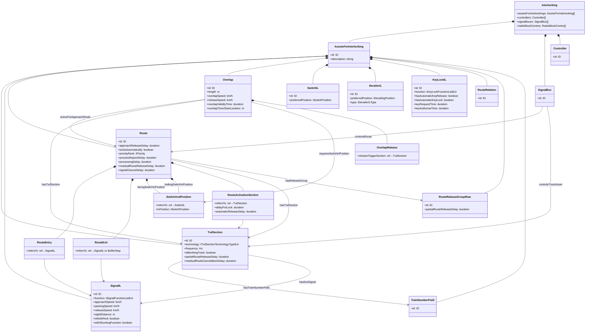

# RailML 3.3 Interlocking Sub-Schema

This document covers the RailML 3.3 `interlocking` sub-schema — routes, signal aspects, track vacancy detection, overlaps, approach locking, and operational zones. For common primitives, see [railml.md](railml.md).

---

## UK / British Rail Terminology Mapping

| UK term | RailML equivalent | Where |
|---|---|---|
| Berth (track circuit section) | `TvdSection` | interlocking |
| Headcode / train description display | `TrainNumberField` on `TvdSection` | interlocking |
| TD stepping (headcode moves berth to berth) | `hasTrainNumberField` link on each `TvdSection` | interlocking |
| Berthing track (reversing siding) | `TvdSection/@isBerthingTrack` | interlocking |
| Overlap / braking distance | `Overlap` | interlocking |
| Partial route release / berth release | `RouteReleaseGroupRear` | interlocking |
| Junction indicator | `junctionIndicator` signal aspect | interlocking |
| Path-dependent signalling | `Route` with `routeEntry`/`routeExit` | interlocking |
| Track circuit | `TvdSection` with `technology="trackCircuit"` | interlocking |
| Axle counter section | `TvdSection` with `technology="axleCounter"` | interlocking |
| Fouling bar | `TrainDetectionElement` of mechanical type | infrastructure |
| TIPLOC | `Designator` with `register="TPLC"` | any |
| STANOX (TOPS) | `Designator` with `register="STNX"` | any |

The `isBerthingTrack` attribute (XSD annotation):

> *"True, if this section is part of a berthing track, i.e. track where trains may halt and change direction. Typically, an Interlocking assures that trains progress from section to section in an ordered sequence (aka. two/three phase release). This check would fail when a train changes direction. If this attribute is true, the interlocking doesn't carry out this check for this section."*

`junctionIndicator` and `distantJunctionIndicator` are built-in aspect enumeration values, covering path-dependent signalling where a signal shows a different aspect per set route.

Not in scope: the headcode string format itself (lives in the timetable sub-schema), real-time TD feed protocols (TRUST), and AWS/TPWS (not enumerated but the train-protection code lists are extensible).

---

## Top-Level Structure

```
interlocking
├── assetsForInterlockings
│   └── assetsForInterlocking [1..*]
│       ├── tracksIL
│       ├── switchesIL
│       ├── derailersIL
│       ├── movableCrossings
│       ├── signalsIL
│       ├── tvdSections          ← berths / track circuits / axle counter sections
│       ├── genericDetectors
│       ├── keys / keyLocksIL
│       ├── routes
│       ├── conflictingRoutes
│       ├── routeRelations
│       ├── combinedRoutes
│       ├── overlaps
│       ├── dangerPoints
│       ├── destinationPoints
│       ├── trainNumberFields    ← headcode displays (TD berth labels)
│       ├── signalIndicators
│       ├── routeStatusIndicators
│       ├── workZones
│       ├── shuntingZones
│       ├── dangerAreas
│       ├── emergencyStopAreas
│       ├── permissionZones
│       ├── routeReleaseGroupsAhead
│       ├── routeReleaseGroupsRear
│       ├── interfaces
│       ├── powerSuppliesIL
│       └── linesideElectronicUnitsIL
├── controllers
├── objectControllers
├── signalBoxes
└── radioBlockCentres
```

---

## Class Diagram



---

## `tvdSection` — Track Vacancy Detection (Berths)

A TVD section is the interlocking's view of a track section — it reports occupied or vacant. In British signalling this is a **berth**.

| Attribute | Type | Description |
|---|---|---|
| `technology` | enum | `trackCircuit`, `axleCounter`, `insulatedRailJoint`, … |
| `frequency` | Hz | Track circuit frequency (0 = DC) |
| `isBerthingTrack` | boolean | True for sections where trains reverse — disables ordered phase-release check |
| `partialRouteReleaseDelay` | duration | Delay before a released section clears for re-use |
| `residualRouteCancellationDelay` | duration | Cleanup delay after abnormal train runs |

| Child | Description |
|---|---|
| `hasDemarcatingTraindetector` | Axle counters or insulated joints at the section boundaries |
| `hasExitSignal` | Signals delimiting the section exit (up to 2) |
| `hasDemarcatingBufferstop` | Buffer stops at track ends |
| `hasTrackElement` | Switches, crossings, etc. within the section |
| `hasTrainNumberField` | **Headcode display** associated with this berth |

---

## `trainNumberField` — Headcode Display (TD berth label)

`TrainNumberField` represents the physical or virtual display on the signaller's panel that shows the train's headcode as it steps through berths. Each `TvdSection` links to its label via `hasTrainNumberField`.

| Attribute | Description |
|---|---|
| `id` | Unique identifier |
| `designator[]` | External identifiers for this display position |

---

## `signalIL` — Signal (Interlocking View)

`SignalIL` is the interlocking's logical view of a signal — distinct from the physical `SignalIS` in infrastructure. It expresses what the signal *does* rather than what it *looks like*.

| Attribute | Unit | Description |
|---|---|---|
| `function` | enum | `main`, `distant`, `shunting`, `combined`, `blocking`, `exit`, … |
| `approachSpeed` | km/h | Speed at which a train should approach |
| `passingSpeed` | km/h | Maximum speed past the signal |
| `releaseSpeed` | km/h | Speed used to calculate overlap release |
| `sightDistance` | m | Distance from which the driver can read the signal |
| `isNotWired` | boolean | Virtual signal or standalone board (no physical lamps) |
| `withShuntingFunction` | boolean | Signal combines main and shunting aspects |

| Child | Description |
|---|---|
| `allowsAspect` | Aspects this signal is capable of displaying |
| `hasLamp` | Lamp types installed (`LED`, `singleFilamentBulb`, `virtual`, …) |
| `hasIndicator` | Junction indicators, route indicators |
| `hasRepeater` | Repeater signals downstream |
| `protectsBlockExit` | TVD sections this signal protects |

### Signal aspects

| Aspect | Meaning |
|---|---|
| `closed` | Stop |
| `proceed` | Line clear, no speed restriction |
| `limitedProceed` | Proceed at restricted speed |
| `caution` | Expect stop at next signal |
| `warning` | Expect a proceed aspect at next signal |
| `callOn` | Pass at reduced speed with clear visibility (occupied line) |
| `shuntingProceed` / `slowShunting` | Shunting movements |
| `junctionIndicator` | Route direction indicator (UK path-dependent signalling) |
| `distantJunctionIndicator` | Advance warning of junction route |
| `restriction` | Speed indicator board |
| `repeating` | Repeats the aspect of the following signal |
| `dark` | Signal intentionally switched off |

---

## `route` — Route

A route is the interlocking's core safety unit: entry signal → exit signal, with all intermediate switch positions defined. The interlocking locks the route and sets a proceed aspect only when all conditions are satisfied.

| Attribute | Type | Description |
|---|---|---|
| `locksAutomatically` | boolean | Route locks automatically when approach section occupied |
| `priorityRank` | tPriority | Which route wins if multiple paths to same exit |
| `proceedAspectDelay` | duration | Delay between route set and signal clearing |
| `processingDelay` | duration | Time for interlocking logic to process route request |
| `residualRouteReleaseDelay` | duration | Delay before route is released after train clears |
| `signalClosureDelay` | duration | Time between last train detection and signal closing |
| `approachReleaseDelay` | duration | Delay between approach detection and release |

| Child | Description |
|---|---|
| `routeEntry` | Start signal (ref → `SignalIL`) |
| `routeExit` | Destination signal or buffer stop |
| `facingSwitchInPosition` | Facing switches and their required positions |
| `trailingSwitchInPosition` | Trailing switches and their required positions |
| `hasTvdSection` | All TVD sections within the route path |
| `routeActivationSection` | Approach detection sections that trigger locking |
| `hasReleaseGroup` | Partial route release groups (rear release as train progresses) |
| `additionalRelation` | Flank protection and other side conditions |

### `routeEntry` / `routeExit`

| Attribute | Description |
|---|---|
| `refersTo` | IDREF to a `SignalIL` (entry) or `SignalIL` / buffer stop (exit) |

### `switchAndPosition`

Used in `facingSwitchInPosition`, `trailingSwitchInPosition`, and overlap `requiresSwitchInPosition`.

| Attribute | Description |
|---|---|
| `refersTo` | IDREF to a `SwitchIL` |
| `inPosition` | Required position: `left`, `right`, or `both` |

### `routeActivationSection`

Defines an approach detection TVD section that triggers route locking when occupied.

| Attribute | Description |
|---|---|
| `refersTo` | IDREF to a `TvdSection` |
| `delayForLock` | Duration between section occupation and route locking |
| `automaticReleaseDelay` | Duration after which a locked-but-unset route is automatically released |

### Route types

| Type | Description |
|---|---|
| `normal` | Standard signalled route |
| `shunting` | Low speed, destination may be occupied |
| `block` | Open line / automatic block |
| `callOn` | Occupied destination, operator responsibility |
| `withoutDependency` | Unsupervised section (telephone block working) |
| `siding` | Exit to open-line siding |

---

## `overlap` — Overlap (Braking Distance)

The overlap is the section of track beyond a stop signal that must remain clear to protect against a train overrunning — exactly the UK concept of the same name.

| Attribute | Unit | Description |
|---|---|---|
| `length` | m | Alternative to specifying individual TVD sections |
| `overlapSpeed` | km/h | Maximum speed of conflicting trains in the overlap |
| `releaseSpeed` | km/h | Speed used to determine overlap release |
| `overlapValidityTime` | duration | ETCS T_OL validity time |
| `overlapTimerStartLocation` | m | Distance from timer start to end of movement authority |

| Child | Description |
|---|---|
| `activeForApproachRoute` | Routes that use this overlap |
| `hasTvdSection` | TVD sections forming the overlap path |
| `requiresSwitchInPosition` | Switches that must be locked in the overlap |
| `overlapRelease` | Release conditions: timer, speed, section vacation |
| `additionalRelation` | Flank protection dependencies |

### `overlapRelease`

| Attribute/child | Description |
|---|---|
| `releaseTriggerSection` | IDREF to the `TvdSection` whose occupation starts the release timer |
| `overlapReleaseTimer[]` | One or more timers, each with a duration and optional conditions |
| `releaseSpeed` | Speed below which the timer may start |

---

## `routeRelation` — Conditions on Route Setting

A route relation expresses additional prerequisites for a signal to clear — used for flank protection, approach locking, and interlocking between adjacent signal boxes.

| Child | Description |
|---|---|
| `requiredSwitchPosition` | A switch must be in a given position |
| `requiredDetectorState` | A detector must be activated or deactivated |
| `requiredSignalAspect` | Another signal must show a specific aspect |
| `requiredSectionState` | A TVD section must be occupied or vacant |
| `requiredKeyLockState` | A key lock must be in a given state |

---

## `routeReleaseGroupRear` — Partial Route Release

As a train progresses forward, sections behind it can be released in groups rather than all at once. This is the RailML model of UK berth-by-berth (section-by-section) release.

| Attribute | Description |
|---|---|
| `partialRouteReleaseDelay` | Delay before the group is released |

Release can be triggered by:

| Trigger | Description |
|---|---|
| `byOccupation` | Triggered when the next TVD section is occupied |
| `byOperator` | Manual operator command |
| `byTrainStandstill` | Train confirms standstill |
| `afterVacation` | Section has been vacated |

---

## `switchIL` / `derailerIL`

The interlocking's logical view of points and trap switches — distinct from the physical `SwitchIS` in infrastructure.

| `switchIL` attribute | Description |
|---|---|
| `preferredPosition` | Default position when not set for a route: `left`, `right` |

| `derailerIL` attribute | Description |
|---|---|
| `preferredPosition` | `derailingPosition`, `passablePosition`, `indifferent` |
| `type` | `singleDerailer`, `doubleDerailer` |

---

## `keyLockIL` — Key Lock

A field device used to request local (manual) control of one or more interlocking assets, releasing them from computer control.

| Attribute | Type | Description |
|---|---|---|
| `function` | `tKeyLockFunctionListExt` | Which interlocking element is being locally controlled |
| `hasAutomaticKeyRelease` | boolean | Key is released automatically when the associated TVD section becomes occupied |
| `hasAutomaticKeyLock` | boolean | Key relocks automatically when returned to the device |
| `keyRequestTime` | duration | Time between operator request and key availability |
| `keyAuthoriseTime` | duration | Time the key remains valid after authorisation |

| Child | Description |
|---|---|
| `acceptsKey` | The specific key element that fits this lock |
| `hasTvdSection` | Associated TVD section (e.g. the siding being released) |
| `hasSlaveLock` | Dependent key locks that are also released |

---

## `controller` — Operator Workstation

A controller is an operator workstation or ATC system that can request routes and receive status from one or more interlockings.

| Child | Description |
|---|---|
| `controlledInterlocking[]` | Interlockings this controller has authority over |
| `controlledSystemAsset[]` | Individual assets directly controlled |
| `routeSequences` | Pre-defined sequences of routes for one-button operation |

---

## `signalBox` — Interlocking System

A signal box is the fail-safe interlocking computer responsible for a set of assets and routes.

| Child | Description |
|---|---|
| `controlsTrackAsset` | Signals, switches, TVD sections under this box's authority |
| `controlsRoute` | Routes implemented by this box |
| `controlsInterface` | Interfaces to adjacent signal boxes |
| `implementsSignalplan` | Signal plan documents |

---

## Key Enumerations

| Type | Values |
|---|---|
| `tTvdSectionTechnologyTypeExt` | `trackCircuit`, `axleCounter`, `insulatedRailJoint`, … |
| `tSignalFunctionListExt` | `main`, `distant`, `shunting`, `combined`, `blocking`, `exit`, … |
| `tGenericRouteTypeList` | `normal`, `shunting`, `block`, `callOn`, `occupied`, `siding`, … |
| `tSwitchPosition` | `left`, `right`, `both` |
| `tDerailingPosition` | `derailingPosition`, `passablePosition`, `indifferent` |
| `tKeyLockFunctionListExt` | Function of the interlocking element being locally controlled |
| Release trigger | `byOccupation`, `byOperator`, `byTrainStandstill`, `afterVacation` |

---
