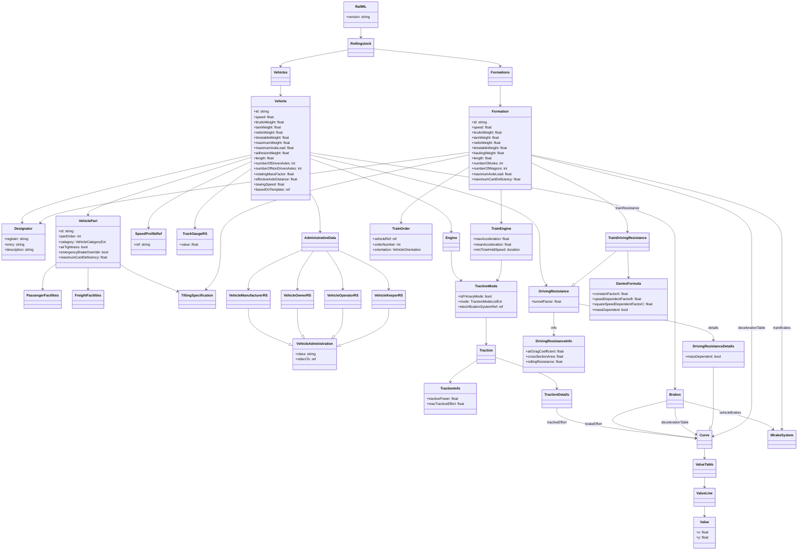

# RailML 3.3 Rollingstock Tooling

This document describes the Python utilities in `python/` for generating and
validating RailML 3.3 rollingstock XML files.

## Overview

The tooling uses [pydantic-xml](https://pydantic-xml.readthedocs.io/) to
declare RailML elements as Python dataclasses with XML annotations baked in.
This means the same model objects that hold your data can serialise directly to
schema-valid XML and deserialise back again — no hand-written XML builder code
required.

```
python/
├── model/
│   ├── __init__.py
│   └── rollingstock.py     # pydantic-xml models for RailML 3.3 rollingstock
├── tests/
│   └── test_rollingstock.py
└── make_railml_rollingstock.py   # sample generator + XSD validator
```

## Quick start

```bash
# Generate a Class 66 + 5 × Mk3 consist and validate against the XSD:
uv run make-railml-rollingstock output.xml

# Vary the number of coaches:
uv run make-railml-rollingstock output.xml --coaches 8

# Run unit tests:
uv run pytest
```

## Model hierarchy

```
RailML
└── Rollingstock
    ├── Vehicles
    │   └── Vehicle  (one per vehicle class / individual unit)
    │       ├── Designator              (UIC number, operator code, …)
    │       ├── VehiclePart             (physical sections of the vehicle)
    │       │   ├── PassengerFacilities
    │       │   │   ├── Places
    │       │   │   └── Service
    │       │   ├── FreightFacilities
    │       │   └── TiltingSpecification
    │       ├── Engine
    │       │   └── PowerMode           (diesel / electric / battery)
    │       │       └── TractionData
    │       │           ├── TractionInfo      (scalar summary)
    │       │           └── TractionDetails
    │       │               └── TractiveEffortCurve  (speed → force table)
    │       ├── Brakes
    │       │   ├── BrakeSystem         (0..* vehicleBrakes)
    │       │   │   └── AuxiliaryBrakes
    │       │   ├── BrakeEffortCurve
    │       │   └── DecelerationCurve
    │       ├── AdministrativeData
    │       │   ├── VehicleManufacturerRS
    │       │   ├── VehicleOwnerRS
    │       │   ├── VehicleOperatorRS
    │       │   └── VehicleKeeperRS
    │       ├── DrivingResistance
    │       │   ├── DrivingResistanceInfo   (scalar Cd, area, rolling resistance)
    │       │   └── DrivingResistanceDetails (speed → resistance curve)
    │       ├── SpeedProfileRef
    │       └── TrackGaugeRS
    └── Formations
        └── Formation               (a consist of vehicles)
            ├── Designator
            ├── TrainOrder          (vehicle position in consist)
            ├── TrainEngine         (consist-level traction summary)
            │   └── TrainTractionMode
            ├── FormationBrakeSystem (0..* trainBrakes)
            │   └── AuxiliaryBrakes
            ├── TiltingSpecification
            ├── TrainDrivingResistance
            │   ├── DrivingResistanceInfo
            │   ├── DrivingResistanceDetails
            │   └── DaviesFormula   (Davis equation A + B·v + C·v²)
            └── FormationDecelerationCurve
```



Value tables (speed–force, speed–deceleration, etc.) are represented by the
`ValueTable` / `ValueLine` / `Value` trio, which map directly to the
`common3.xsd` types.

## Namespace handling

All models live in the `https://www.railml.org/schemas/3.3` namespace,
serialised with the `rail3:` prefix.  This is achieved by:

1. A shared base class that carries the nsmap:
   ```python
   class _Base(BaseXmlModel, nsmap={"rail3": NS}):
       pass
   ```
2. Every model class inherits from `_Base` and declares `ns="rail3"`.
3. The root `RailML` model also carries the nsmap so the declaration appears
   once on the document root element.

The result is well-formed XML that xmlschema can validate:

```xml
<?xml version='1.0' encoding='utf-8'?>
<rail3:railML xmlns:rail3="https://www.railml.org/schemas/3.3" version="3.3">
  <rail3:rollingstock>
    ...
  </rail3:rollingstock>
</rail3:railML>
```

## XmlBool

RailML's XSD uses `xs:boolean`, which requires lowercase `"true"` / `"false"`.
Python's default `str(True)` produces `"True"`, which fails XSD validation.
The `XmlBool` type alias applies a custom serialiser:

```python
XmlBool = Annotated[bool, PlainSerializer(lambda v: "true" if v else "false", return_type=str)]
```

This is used for `isPrimaryMode` and `massDependent`.

## Serialisation

```python
from model.rollingstock import RailML, Rollingstock, Vehicles, Vehicle

railml = RailML(
    rollingstock=Rollingstock(
        vehicles=Vehicles(vehicles=[Vehicle(id="my_loco", speed=120)])
    )
)

# To an XML string (None fields omitted so xs:decimal attrs are not empty):
xml_str = railml.to_xml(encoding="unicode", exclude_none=True)

# To an Element for further manipulation / pretty-printing:
from xml.etree.ElementTree import fromstring, indent, ElementTree
import xml.etree.ElementTree as ET
ET.register_namespace("rail3", "https://www.railml.org/schemas/3.3")
root = fromstring(xml_str)
indent(root, space="  ")
ElementTree(root).write("output.xml", encoding="unicode", xml_declaration=True)
```

## XSD validation

The `railml/railML-3.3-SR1/` directory contains the official RailML 3.3 SR1
schema files.  The Dublin Core Terms namespace
(`http://purl.org/dc/terms/`) is referenced by `common3.xsd` but the upstream
URL is unavailable; a minimal stub is provided at
`railml/railML-3.3-SR1/source/schema/dcterms_stub.xsd`.

```python
import xmlschema
from pathlib import Path

schema_path = Path("railml/railML-3.3-SR1/source/schema/railml3.xsd")
dcterms_stub = str(schema_path.parent / "dcterms_stub.xsd")

xs = xmlschema.XMLSchema(
    str(schema_path),
    locations={"http://purl.org/dc/terms/": dcterms_stub},
)
xs.validate("output.xml")
```

## Unit tests

Tests live in `python/tests/test_rollingstock.py` and cover:

| Group | What is tested |
|---|---|
| `TestValueTable` | Attribute serialisation, child elements, empty list |
| `TestDesignator` | `register` alias, optional `description` omission |
| `TestDaviesFormula` | `XmlBool` lowercase serialisation for `massDependent` |
| `TestDrivingResistance` | Optional `tunnelFactor`, `info` child element |
| `TestVehicle` | All scalar attrs, optional attr omission, engine, brakes |
| `TestFormation` | `trainOrder`, `trainEngine`, `trainResistance` |
| `TestNamespace` | Root tag in correct namespace, all descendants namespaced |
| `TestRoundTrip` | `to_xml` → `from_xml` identity for key models |

Run with:

```bash
uv run pytest -v
```
