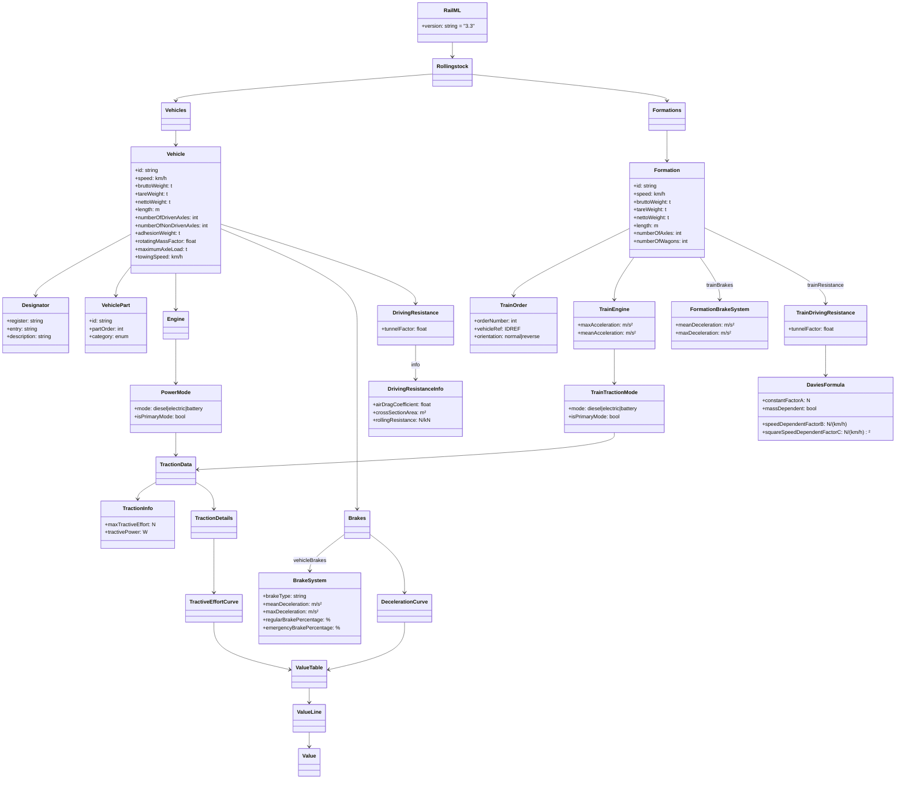

# RailML 3.3 Rollingstock Sub-Schema

This document covers the RailML 3.3 `rollingstock` sub-schema — element semantics, attribute units, curve conventions, and the mapping from RailML fields to the physics engine. For common primitives (`designator`, `valueTable`, namespace), see [railml.md](railml.md). For the Python tooling that generates and validates RailML files, see the [Python tooling](#python-tooling) section below.

---

## Document Structure

```
rollingstock
├── vehicles
│   └── vehicle [1..*]
│       ├── designator
│       ├── vehiclePart
│       ├── engine
│       │   └── powerMode
│       │       └── tractionData
│       ├── brakes
│       ├── drivingResistance
│       └── administrativeData
└── formations
    └── formation [1..*]
        ├── designator
        ├── trainOrder [1..*]
        ├── trainEngine
        ├── trainBrakes
        └── trainResistance
            └── daviesFormulaFactors
```

A **vehicle** is a single rolling-stock unit (locomotive, coach, wagon). A **formation** is an ordered sequence of vehicles coupled as an operational consist. The simulator reads formations, not individual vehicles.

---

## Class Diagram



---

## `vehicle` Element

Represents a single vehicle class or individual unit.

### Attributes

| Attribute | Unit | Description |
|---|---|---|
| `id` | — | Unique identifier; referenced by `trainOrder/@vehicleRef` |
| `speed` | km/h | Maximum permissible speed |
| `bruttoWeight` | t | Gross mass (tare + max payload + passengers at ~75 kg/person) |
| `tareWeight` | t | Empty operational mass. **Used as vehicle mass in physics calculations.** |
| `nettoWeight` | t | Maximum payload |
| `length` | m | Overall length over buffers/couplings |
| `numberOfDrivenAxles` | — | Must be > 0 for vehicles with an `engine` |
| `numberOfNonDrivenAxles` | — | Contributes to rolling resistance |
| `adhesionWeight` | t | Tare weight usable for traction (adhesion limit estimation) |
| `rotatingMassFactor` | — | Multiplier on static mass to account for rotating inertia. Typical range 1.05–1.25. |
| `maximumAxleLoad` | t | Maximum static load per axle |
| `towingSpeed` | km/h | Maximum speed when being towed |

### `vehiclePart`

Physical section of the vehicle body.

| Attribute | Description |
|---|---|
| `id` | Unique identifier |
| `partOrder` | Position within the vehicle, starting at 1 |
| `category` | `locomotive`, `motorCoach`, `passengerCoach`, `freightWagon`, `cabCoach`, `booster` |
| `airTightness` | Whether the section is pressure-sealed |
| `emergencyBrakeOverride` | Whether passengers can activate an emergency brake override |
| `maximumCantDeficiency` | Maximum cant deficiency tolerated by this part |

### `engine`

Container for one or more `powerMode` children. No attributes of its own.

| Child | Description |
|---|---|
| `powerMode[]` | One entry per traction mode (diesel, electric, battery) |

### `powerMode`

| Attribute | Description |
|---|---|
| `mode` | `diesel`, `electric`, or `battery` |
| `isPrimaryMode` | `"true"` for the main propulsion source; a vehicle may carry multiple modes |

| Child | Description |
|---|---|
| `tractionData` | Traction characteristics for this mode |

### `tractionData`

| Child | Description |
|---|---|
| `info` | Scalar summary: `maxTractiveEffort` (N), `tractivePower` (W) |
| `details` | Speed-dependent tractive effort curve |

### `tractionInfo`

| Attribute | Unit | Description |
|---|---|---|
| `maxTractiveEffort` | N | Maximum tractive effort at standstill |
| `tractivePower` | W | Maximum continuous traction power |

### `tractionDetails`

Container for the speed-dependent tractive effort curve.

| Child | Description |
|---|---|
| `tractiveEffort` | Wraps a `valueTable` of speed (km/h) vs force (N) |

### `tractiveEffortCurve`

Wraps a single `valueTable` with `xValueName="speed"`, `xValueUnit="km/h"`, `yValueName="tractiveEffort"`, `yValueUnit="N"`. See [railml.md](railml.md) for the `valueTable` format.

### `engine` > `powerMode` > `tractionData`

```xml
<rail3:engine>
  <rail3:powerMode mode="diesel" isPrimaryMode="true">
    <rail3:tractionData>
      <!-- Scalar summary — used by the physics engine -->
      <rail3:info maxTractiveEffort="270000" tractivePower="2420000" />
      <!-- Speed-dependent curve (informational, not yet used by physics engine) -->
      <rail3:details>
        <rail3:tractiveEffort>
          <rail3:valueTable xValueName="speed" xValueUnit="km/h"
                            yValueName="tractiveEffort" yValueUnit="N">
            <rail3:valueLine xValue="0">  <rail3:value yValue="270000" /></rail3:valueLine>
            <rail3:valueLine xValue="20"> <rail3:value yValue="270000" /></rail3:valueLine>
            <rail3:valueLine xValue="40"> <rail3:value yValue="200000" /></rail3:valueLine>
            <rail3:valueLine xValue="60"> <rail3:value yValue="133000" /></rail3:valueLine>
            <rail3:valueLine xValue="80"> <rail3:value yValue="100000" /></rail3:valueLine>
            <rail3:valueLine xValue="100"><rail3:value yValue="80000"  /></rail3:valueLine>
            <rail3:valueLine xValue="120"><rail3:value yValue="66000"  /></rail3:valueLine>
          </rail3:valueTable>
        </rail3:tractiveEffort>
      </rail3:details>
    </rail3:tractionData>
  </rail3:powerMode>
</rail3:engine>
```

`mode` is one of `diesel`, `electric`, `battery`. `isPrimaryMode="true"` marks the main propulsion source; a vehicle may have multiple power modes (e.g. dual-mode).

### `brakes`

### `decelerationCurve`

Wraps a single `valueTable` with `xValueName="speed"`, `xValueUnit="km/h"`, `yValueName="deceleration"`, `yValueUnit="m/s/s"`.

| Child | Description |
|---|---|
| `vehicleBrakes` (0..*) | Brake system configuration |
| `brakeEffort` | Speed-dependent brake force curve (N vs km/h) |
| `decelerationTable` | Speed-dependent deceleration curve (m/s² vs km/h) |

Key `vehicleBrakes` attributes:

| Attribute | Unit | Description |
|---|---|---|
| `brakeType` | — | Technology: vacuum, compressed air, hand brake, etc. |
| `meanDeceleration` | m/s² | Mean deceleration over a complete braking operation |
| `maxDeceleration` | m/s² | Maximum instantaneous deceleration |
| `regularBrakePercentage` | % | Brake percentage for normal operations |
| `emergencyBrakePercentage` | % | Brake percentage for emergency braking |

```xml
<rail3:brakes>
  <rail3:decelerationTable>
    <rail3:valueTable xValueName="speed" xValueUnit="km/h"
                      yValueName="deceleration" yValueUnit="m/s/s">
      <rail3:valueLine xValue="0">  <rail3:value yValue="0.90" /></rail3:valueLine>
      <rail3:valueLine xValue="40"> <rail3:value yValue="0.85" /></rail3:valueLine>
      <rail3:valueLine xValue="80"> <rail3:value yValue="0.75" /></rail3:valueLine>
      <rail3:valueLine xValue="120"><rail3:value yValue="0.65" /></rail3:valueLine>
    </rail3:valueTable>
  </rail3:decelerationTable>
</rail3:brakes>
```

### `drivingResistance`

| Attribute | Description |
|---|---|
| `tunnelFactor` | Multiplier on resistance inside a tunnel (typically 1.5–2.0) |

| Child | Description |
|---|---|
| `info` | Scalar parameters: `airDragCoefficient` (Cd), `crossSectionArea` (m²), `rollingResistance` (N/kN) |
| `details` | Speed-dependent resistance curve |

```xml
<rail3:drivingResistance tunnelFactor="1.5">
  <rail3:info airDragCoefficient="0.80" crossSectionArea="9.5" rollingResistance="1.5" />
</rail3:drivingResistance>
```

---

## `formation` Element

The operational consist — an ordered list of vehicles. This is the primary unit read by the simulator.

### Attributes

| Attribute | Unit | Description |
|---|---|---|
| `id` | — | Unique identifier; referenced in the YAML config |
| `speed` | km/h | Formation maximum speed (minimum across all vehicles) |
| `bruttoWeight` | t | Gross mass of the complete consist |
| `tareWeight` | t | Empty operational mass. **Used as formation mass in physics calculations.** |
| `nettoWeight` | t | Total payload capacity |
| `length` | m | Overall formation length |
| `numberOfAxles` | — | Total axle count |
| `numberOfWagons` | — | Number of vehicles in the consist |

### `trainOrder`

| Attribute | Description |
|---|---|
| `orderNumber` | Position in the consist, starting at 1 |
| `vehicleRef` | IDREF pointing to a `vehicle/@id` |
| `orientation` | `"normal"` (default) or `"reverse"` |

### `trainEngine`

Aggregated traction for the formation. Contains a `tractionMode` child.

### `tractionMode` (class name: `TrainTractionMode`)

The XML element is `tractionMode`; the Python/class name is `TrainTractionMode`. Same attributes as vehicle `powerMode`.

| Attribute | Description |
|---|---|
| `mode` | `diesel`, `electric`, or `battery` |
| `isPrimaryMode` | `"true"` for the primary traction mode |

| Child | Description |
|---|---|
| `tractionData` | Scalar traction summary (`info`) for the formation |

| Attribute | Unit | Description |
|---|---|---|
| `maxAcceleration` | m/s² | Maximum achievable acceleration |
| `meanAcceleration` | m/s² | Mean acceleration over a departure manoeuvre |

### `trainBrakes`

Formation-level brake system (class name: `FormationBrakeSystem`). The key attribute for the physics engine is `meanDeceleration`:

```
F_braking = meanDeceleration × formation_mass_kg
```

| Attribute | Unit | Description |
|---|---|---|
| `brakeType` | — | Technology: vacuum, compressed air, etc. |
| `meanDeceleration` | m/s² | Mean deceleration over a complete braking operation. **Used by the physics engine.** |
| `maxDeceleration` | m/s² | Maximum instantaneous deceleration |
| `regularBrakePercentage` | % | Brake percentage for normal operations |
| `emergencyBrakePercentage` | % | Brake percentage for emergency braking |

```xml
<rail3:trainBrakes meanDeceleration="0.9" />
```

### `trainResistance` > `daviesFormulaFactors`

The Davis equation expresses rolling resistance as a polynomial in speed:

```
R(v) = A + B·v + C·v²   (v in km/h, R in N)
```

| Attribute | Unit | Description |
|---|---|---|
| `constantFactorA` | N | Constant term — bearing friction, track irregularity |
| `speedDependentFactorB` | N/(km/h) | Linear term — flange friction, lateral oscillation |
| `squareSpeedDependentFactorC` | N/(km/h)² | Aerodynamic drag term |
| `massDependent` | xs:boolean | `"true"` if A and B scale with mass |

```xml
<rail3:trainResistance tunnelFactor="1.8">
  <rail3:daviesFormulaFactors
      constantFactorA="3800"
      speedDependentFactorB="45"
      squareSpeedDependentFactorC="2.5"
      massDependent="false" />
</rail3:trainResistance>
```

---

## Unit Conversions

The physics engine works in SI units (m, s, kg, N). RailML uses mixed units.

### Mass

RailML weights are in **tonnes**:

```
mass_kg = tareWeight_t × 1000
```

### Davis C coefficient (aerodynamic drag)

`squareSpeedDependentFactorC` is in N/(km/h)². The physics engine uses `drag_coeff × v_ms²` (v in m/s):

```
v_kmh = v_ms × 3.6
F_aero = C × (v_ms × 3.6)² = C × 12.96 × v_ms²

→ drag_coeff [kg/m] = C [N/(km/h)²] × 12.96
```

### Summary

| RailML field | RailML unit | Physics field | SI unit | Factor |
|---|---|---|---|---|
| `formation/@tareWeight` | t | `mass` | kg | × 1000 |
| `tractionData/info/@tractivePower` | W | `power` | W | × 1 |
| `tractionData/info/@maxTractiveEffort` | N | `traction_force_at_standstill` | N | × 1 |
| `formation/@speed` | km/h | `max_speed` | km/h | × 1 |
| `daviesFormulaFactors/@squareSpeedDependentFactorC` | N/(km/h)² | `drag_coeff` | kg/m | × 12.96 |
| `trainBrakes/@meanDeceleration` | m/s² | `braking_force` | N | × mass_kg |

---

## Physics Mapping

When the simulator loads a formation it extracts a `TrainDescription` (defined in `src/model.rs`):

```rust
TrainDescription {
    power:                        f64,  // W
    traction_force_at_standstill: f64,  // N
    max_speed:                    f64,  // km/h
    mass:                         f64,  // kg
    drag_coeff:                   f64,  // kg/m  (aerodynamic only)
    braking_force:                f64,  // N
}
```

Extraction paths from the `formation` element:

| `TrainDescription` field | XPath |
|---|---|
| `max_speed` | `@speed` |
| `mass` | `@tareWeight` × 1000 |
| `power` | `trainEngine/tractionMode[@isPrimaryMode='true']/tractionData/info/@tractivePower` |
| `traction_force_at_standstill` | `trainEngine/tractionMode[@isPrimaryMode='true']/tractionData/info/@maxTractiveEffort` |
| `drag_coeff` | `trainResistance/daviesFormulaFactors/@squareSpeedDependentFactorC` × 12.96 |
| `braking_force` | `trainBrakes/@meanDeceleration` × mass_kg |

**Known limitations:** `constantFactorA` and `speedDependentFactorB` are not wired to the physics engine — rolling resistance is approximated as 0.002 × mass × g. The speed-dependent tractive-effort curve in `details` is stored in the XML but the physics engine uses only the scalar `info` values.

---

## Annotated Example

The `output.xml` generated by `uv run make-railml-rollingstock` (trimmed to one coach):

```xml
<?xml version='1.0' encoding='utf-8'?>
<rail3:railML xmlns:rail3="https://www.railml.org/schemas/3.3" version="3.3">
  <rail3:rollingstock>

    <rail3:vehicles>

      <!-- Class 66 diesel-electric locomotive -->
      <rail3:vehicle id="vehicle_class66"
          speed="120"               <!-- max speed km/h -->
          bruttoWeight="130"        <!-- gross mass t -->
          tareWeight="130"          <!-- tare = gross (no payload) -->
          length="21.34"
          numberOfDrivenAxles="6"
          numberOfNonDrivenAxles="0"
          adhesionWeight="130"
          rotatingMassFactor="1.15">

        <rail3:designator register="UIC" entry="92 70 0 066 001-1" />
        <rail3:vehiclePart id="vp_class66_body" partOrder="1" category="locomotive" />

        <rail3:engine>
          <rail3:powerMode mode="diesel" isPrimaryMode="true">
            <rail3:tractionData>
              <rail3:info maxTractiveEffort="270000" tractivePower="2420000" />
              <rail3:details>
                <rail3:tractiveEffort>
                  <rail3:valueTable xValueName="speed" xValueUnit="km/h"
                                    yValueName="tractiveEffort" yValueUnit="N">
                    <rail3:valueLine xValue="0">  <rail3:value yValue="270000" /></rail3:valueLine>
                    <rail3:valueLine xValue="120"><rail3:value yValue="66000"  /></rail3:valueLine>
                  </rail3:valueTable>
                </rail3:tractiveEffort>
              </rail3:details>
            </rail3:tractionData>
          </rail3:powerMode>
        </rail3:engine>

        <rail3:brakes>
          <rail3:decelerationTable>
            <rail3:valueTable xValueName="speed" xValueUnit="km/h"
                              yValueName="deceleration" yValueUnit="m/s/s">
              <rail3:valueLine xValue="0">  <rail3:value yValue="0.90" /></rail3:valueLine>
              <rail3:valueLine xValue="120"><rail3:value yValue="0.65" /></rail3:valueLine>
            </rail3:valueTable>
          </rail3:decelerationTable>
        </rail3:brakes>

        <rail3:drivingResistance tunnelFactor="1.5">
          <rail3:info airDragCoefficient="0.80" crossSectionArea="9.5" rollingResistance="1.5" />
        </rail3:drivingResistance>

      </rail3:vehicle>

      <!-- BR Mk3 passenger coach -->
      <rail3:vehicle id="vehicle_mk3_01"
          speed="200" bruttoWeight="48" tareWeight="33" length="23.0"
          numberOfDrivenAxles="0" numberOfNonDrivenAxles="4">
        <rail3:designator register="operator" entry="Mk3-001" />
        <rail3:vehiclePart id="vp_mk3_01_body" partOrder="1" category="passengerCoach" />
        <rail3:brakes>
          <rail3:decelerationTable>
            <rail3:valueTable xValueName="speed" xValueUnit="km/h"
                              yValueName="deceleration" yValueUnit="m/s/s">
              <rail3:valueLine xValue="0">  <rail3:value yValue="0.80" /></rail3:valueLine>
              <rail3:valueLine xValue="120"><rail3:value yValue="0.65" /></rail3:valueLine>
            </rail3:valueTable>
          </rail3:decelerationTable>
        </rail3:brakes>
        <rail3:drivingResistance>
          <rail3:info airDragCoefficient="0.60" crossSectionArea="9.0" rollingResistance="1.2" />
        </rail3:drivingResistance>
      </rail3:vehicle>

    </rail3:vehicles>

    <rail3:formations>

      <rail3:formation id="formation_class66_mk3"   <!-- referenced in YAML config -->
          speed="120"           <!-- limited by loco -->
          bruttoWeight="226"
          tareWeight="163"
          length="147.34">

        <rail3:designator register="operator" entry="1A23-consist" />

        <!-- Vehicle order -->
        <rail3:trainOrder orderNumber="1" vehicleRef="vehicle_class66" />
        <rail3:trainOrder orderNumber="2" vehicleRef="vehicle_mk3_01" />
        <!-- … more coaches … -->

        <!-- Aggregated traction -->
        <rail3:trainEngine maxAcceleration="0.40" meanAcceleration="0.25">
          <rail3:tractionMode mode="diesel" isPrimaryMode="true">
            <rail3:tractionData>
              <rail3:info maxTractiveEffort="270000" tractivePower="2420000" />
            </rail3:tractionData>
          </rail3:tractionMode>
        </rail3:trainEngine>

        <!-- meanDeceleration drives F_braking in the physics engine -->
        <rail3:trainBrakes meanDeceleration="0.9" />

        <!-- Davis equation for the whole consist -->
        <rail3:trainResistance tunnelFactor="1.8">
          <rail3:daviesFormulaFactors
              constantFactorA="3800"
              speedDependentFactorB="45"
              squareSpeedDependentFactorC="2.5"   <!-- × 12.96 → drag_coeff kg/m -->
              massDependent="false" />
        </rail3:trainResistance>

      </rail3:formation>

    </rail3:formations>
  </rail3:rollingstock>
</rail3:railML>
```

---

## Python Tooling

The Python utilities in `python/` generate and validate RailML rollingstock XML using [pydantic-xml](https://pydantic-xml.readthedocs.io/) — the same model objects that hold data serialise directly to schema-valid XML and back, with no hand-written XML builder code.

```
python/
├── hs_trains/
│   ├── model/
│   │   └── rollingstock.py          # pydantic-xml models for RailML 3.3 rollingstock
│   └── make_railml_rollingstock.py  # sample generator + XSD validator
└── tests/
    └── test_rollingstock.py
```

### Quick start

```bash
# Generate a Class 66 + 5 × Mk3 consist and validate against the XSD:
uv run make-railml-rollingstock output.xml

# Vary the number of coaches:
uv run make-railml-rollingstock output.xml --coaches 8

# Run unit tests:
uv run pytest
```

### Model hierarchy

```
RailML
└── Rollingstock
    ├── Vehicles
    │   └── Vehicle
    │       ├── Designator
    │       ├── VehiclePart
    │       │   ├── PassengerFacilities
    │       │   ├── FreightFacilities
    │       │   └── TiltingSpecification
    │       ├── Engine
    │       │   └── PowerMode (diesel / electric / battery)
    │       │       └── TractionData
    │       │           ├── TractionInfo      (scalar summary)
    │       │           └── TractionDetails
    │       │               └── TractiveEffortCurve
    │       ├── Brakes
    │       │   ├── BrakeSystem (0..* vehicleBrakes)
    │       │   │   └── AuxiliaryBrakes
    │       │   ├── BrakeEffortCurve
    │       │   └── DecelerationCurve
    │       ├── AdministrativeData
    │       │   ├── VehicleManufacturerRS
    │       │   ├── VehicleOwnerRS
    │       │   ├── VehicleOperatorRS
    │       │   └── VehicleKeeperRS
    │       ├── DrivingResistance
    │       │   ├── DrivingResistanceInfo
    │       │   └── DrivingResistanceDetails
    │       ├── SpeedProfileRef
    │       └── TrackGaugeRS
    └── Formations
        └── Formation
            ├── Designator
            ├── TrainOrder
            ├── TrainEngine
            │   └── TrainTractionMode
            ├── FormationBrakeSystem (0..* trainBrakes)
            │   └── AuxiliaryBrakes
            ├── TiltingSpecification
            ├── TrainDrivingResistance
            │   ├── DrivingResistanceInfo
            │   ├── DrivingResistanceDetails
            │   └── DaviesFormula
            └── FormationDecelerationCurve
```

### Namespace handling

All models live in `https://www.railml.org/schemas/3.3`, serialised with the `rail3:` prefix, via a shared base class:

```python
NS = "https://www.railml.org/schemas/3.3"

class _Base(BaseXmlModel, nsmap={"rail3": NS}):
    pass
```

Every model class inherits from `_Base` and declares `ns=NS`. The root `RailML` model carries the `nsmap` so the declaration appears once on the document root element.

### XmlBool

RailML's XSD requires lowercase `"true"` / `"false"`. Python's default `str(True)` produces `"True"` which fails validation. The `XmlBool` type alias applies a custom serialiser:

```python
XmlBool = Annotated[bool, PlainSerializer(lambda v: "true" if v else "false", return_type=str)]
```

Used for `isPrimaryMode` and `massDependent`.

### Serialisation

```python
from hs_trains.model.rollingstock import RailML, Rollingstock, Vehicles, Vehicle

railml = RailML(
    rollingstock=Rollingstock(
        vehicles=Vehicles(vehicles=[Vehicle(id="my_loco", speed=120)])
    )
)

xml_str = railml.to_xml(encoding="unicode", exclude_none=True)

# Pretty-print to file
import xml.etree.ElementTree as ET
from xml.etree.ElementTree import fromstring, indent, ElementTree
ET.register_namespace("rail3", "https://www.railml.org/schemas/3.3")
root = fromstring(xml_str)
indent(root, space="  ")
ElementTree(root).write("output.xml", encoding="unicode", xml_declaration=True)
```

### Unit tests

Tests live in `python/tests/test_rollingstock.py`:

| Group | What is tested |
|---|---|
| `TestValueTable` | Attribute serialisation, child elements, empty list |
| `TestDesignator` | `register` alias, optional `description` omission |
| `TestDaviesFormula` | `XmlBool` lowercase serialisation for `massDependent` |
| `TestDrivingResistance` | Optional `tunnelFactor`, `info` child element |
| `TestVehicle` | All scalar attrs, optional attr omission, engine, brakes |
| `TestFormation` | `trainOrder`, `trainEngine`, `trainResistance` |
| `TestNamespace` | Root tag in correct namespace, all descendants namespaced |
| `TestRoundTrip` | `to_xml` → `from_xml` identity for key models |

```bash
uv run pytest -v
```
